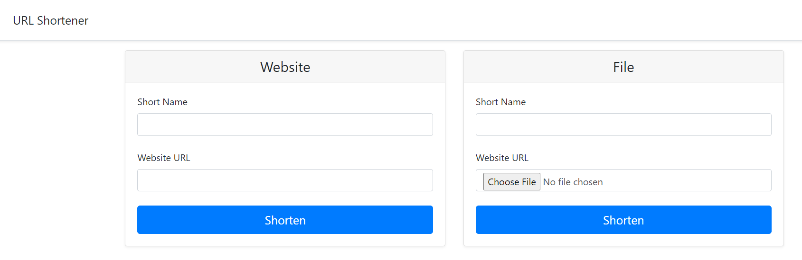

# Automate Build, Test and Deploy URL Shortener Application in Stages

September 15, 2023

By:  Annie V Lam - Kura Labs

# Purpose

Automate Build, Test and Deploy URL Shortener Application in Stages

Previously, the URL Shortener was manually deployed using AWS Elastic Beanstack.  This deployment, AWS Beanstalk CLI is used to automate the Deploy Stage and and GitHub Webhook is fully automate Jenkins "Run Build".

## Step #1 Map Out the Deployment

[Deployment Flowchart](Images/Deployment_Pipeline.png)

## Step #2 Download Repository to GitHub

Github is the repository where Jenkins retrieve the files to build, test, and deploy the URL Shortener application.  In order for the EC2, where Jenkins is installed, to get access to the repository a token needs to be generated from the GitHub and passed to the EC2.

[Generate GitHub Token](https://github.com/LamAnnieV/GitHub/blob/main/Generate_GitHub_Token.md)

## Step #3A Jenkins

**Instructions to Setup a New EC2 Instance**

[Create EC2 Instance](https://github.com/LamAnnieV/Create_EC2_Instance/blob/main/Create_EC2_Instance.md)

[Create IAM Roles for Elastic Beanstalk and EC2](https://github.com/LamAnnieV/Setup_AWS/blob/main/Create_AWS_IAM_Roles.md)

**Shell Scripts for Install(s) in the Instance**

[Install "python3.10-venv", "python-pip", "python3-pip" and "unzip"](https://github.com/LamAnnieV/Instance_Installs/blob/main/02_other_installs.sh)

**Instructions for Jenkins Setup, Install Plugin(s) and Create Build**

[Jenkins Setup](https://github.com/LamAnnieV/Instance_Installs/blob/main/01_jenkins_installs.sh)

[Install "Pipeline Utility Step" Plugin](https://github.com/LamAnnieV/Jenkins/blob/main/Install_Pipeline_Utility_Step_Plugin.md)

### Results

## Step #3B AWS EB CLI

[Create a New Instance](https://github.com/LamAnnieV/Setup_AWS/blob/main/Generate_AWS_CLI_Credentials.md)

[Install CLI](https://github.com/LamAnnieV/Setup_AWS/blob/main/Create_AWS_IAM_Roles.md)

[Install AWS EB CLI Part I](https://github.com/LamAnnieV/Setup_AWS/blob/main/Create_AWS_IAM_Roles.md)

[Install AWS EB CLI Part II](https://github.com/LamAnnieV/Setup_AWS/blob/main/Create_AWS_IAM_Roles.md)

### Results

****Successful Build:****

## Step #3C Webhook

[Install GitHub Webhook](https://github.com/LamAnnieV/Setup_AWS/blob/main/Create_AWS_IAM_Roles.md)

### Results

****Successful Build:****

****Successful Build:****

and Step #4:  Use Jenkins to Auto Build and Auto Test Application

Jenkins is used to automate the Build, Test, and Zipping of the Application files that are need in the deployment stage.  To use Jenkins in a new EC2, all the proper installs to use Jenkins and to read the programing lanuague that the application is written in needs to be installed. In this case, they are Jenkins, Java, Python, and Jenkins additional plugin "Pipeline Utility Steps".

In Jenkins create a build "Deployment02" for the URL Shortner application from GitHub Repository https://github.com/LamAnnieV/Run_Jenkins_Build_and_Deploy_to_EB_Deployment02.git and run the build

## Step #4:  Launch Website

            
## Areas for Optimization
-     Automate installs for Virtual Machines
-     Fully automate the Build and Test stage in Jenkins, from detecting an update in GitHub to sending the files to the Production Server+
-     Automate deploying the application to Production
  

  
